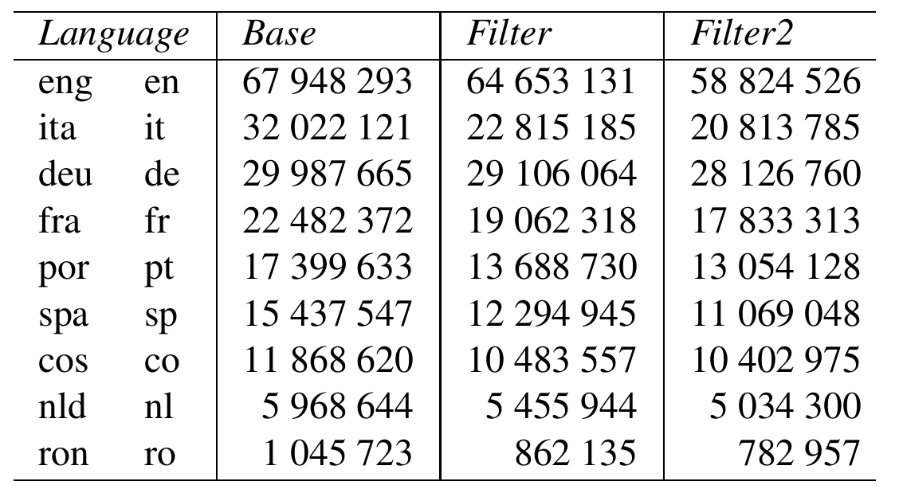

# CoSwID - Code Switching Identification : Language Identification Learning Data.

These data are related to the article "CoSwID, a Code Switching Identification Method Suitable for Under-Ressourced Languages", presented at the [SIGUL Workshop](https://sigul-2022.ilc.cnr.it/) ([LREC2022](https://lrec2022.lrec-conf.org/en/)) by [Laurent Kevers](https://orcid.org/0000-0001-5058-6706) (University of Corsica).

This data was used to train the language identification module LDIG, but it can be used with any other system.

## Overview

Number of characters in the training data (base
corpus or after one or two filtering processes)

## Corsican data

Based on three corpora made available by the BDLC (https://bdlc.univ-corse.fr/tal/index.php?page=res): Wikipedia, A Sacra Bìbbia (the Bible) and A Piazzetta, a local news blog in Corsican.

The licenses are the following :
  * Wikipedia : CC BY-SA 3.0 (https://creativecommons.org/licenses/by-sa/3.0/)
  * A Sacra Bìbbia (the Bible) : CC BY-NC-SA 4.0 (https://creativecommons.org/licenses/by-nc-sa/4.0/)
  * A Piazzetta : (CC BY-NC-SA 4.0) https://creativecommons.org/licenses/by-nc-sa/4.0/

## Other languages Data

Eight European languages are represented : English, French, German, Italian, Dutch, Portuguese, Romanian and Spanish.

Data comes from sentence corpora available on the Tatoeba collaborative platform (https://tatoeba.org).

The license is CC BY 2.0 FR (https://creativecommons.org/licenses/by/2.0/fr/deed.en).
